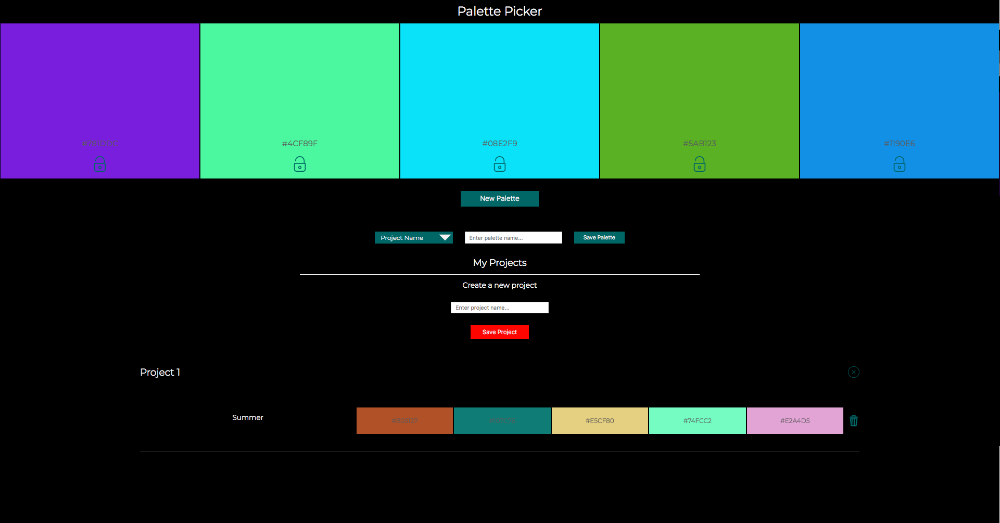

Link to live application:
https://hs-palette-picker-12-1-17.herokuapp.com/

Palette Picker

Palette Picker generates a random color palette and allows the user to create a project and
save color palettes to each project, projects and palettes are saved to a backend database.  This application was built using Javascript, jQuery, Node.js, Express, Knex, Postgresql.  

